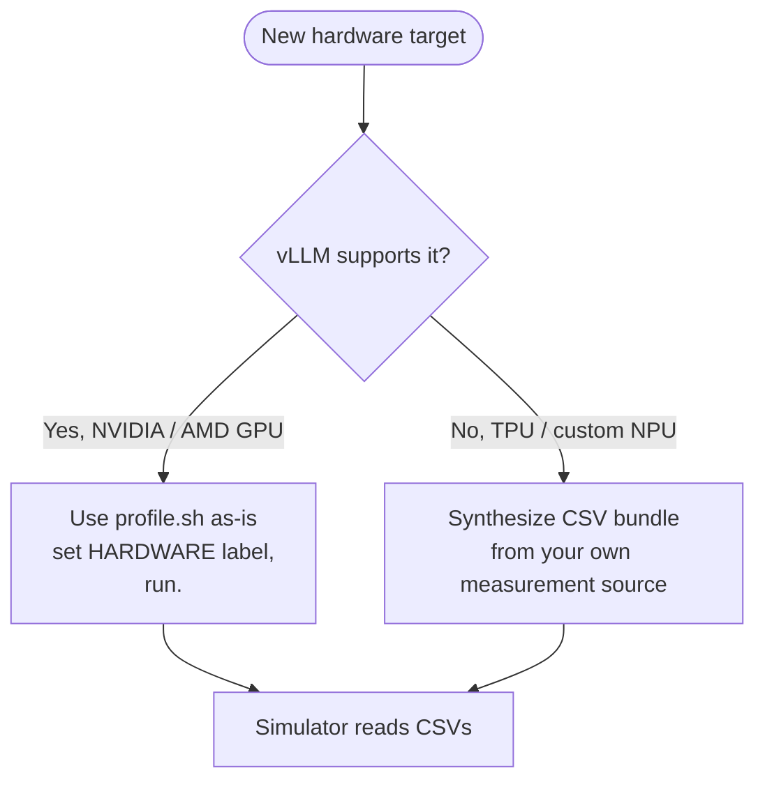

# Adding new hardware

This page is the workflow for bringing up a brand-new hardware target
that doesn't have a profile bundle in `profiler/perf/<HARDWARE>/`
yet. There are two distinct paths depending on whether vLLM supports
the hardware:



The CSV bundle format described on **[Output bundle](./output-bundle)**
is the contract. Once you produce one, the simulator works the same
way regardless of how the data was collected.

## Adding a new GPU

This is the easy case. The profiler's vLLM-based workflow already
handles it. Three steps:

### 1. Confirm vLLM support

The profiler runs vLLM `0.19.0` by default
(`scripts/docker-vllm.sh` pulls `vllm/vllm-openai:v0.19.0`). Check
that vLLM's release notes mention your GPU.

| GPU family | vLLM 0.19.0 support |
| --- | --- |
| NVIDIA A100, H100, H200 | Yes |
| NVIDIA RTX PRO 6000, RTX 6000 Ada, L40S | Yes |
| NVIDIA Blackwell (B100, B200) | Yes (with CUDA 13.x image: `v0.19.0-cu130`) |
| NVIDIA Hopper SXM | Yes |
| AMD MI300X | Yes (ROCm path; needs `vllm/vllm-rocm`) |
| AMD MI200 / older | Limited; check vLLM matrix |
| Intel Gaudi 3 | Limited (HPU plugin); not supported by this profile path |

If vLLM doesn't support it yet, you have two options: wait for vLLM
to add support, or contribute the backend to vLLM upstream. Neither
is fast.

### 2. Edit `profile.sh`

```bash
HARDWARE="H100"                 # or whatever you want as the folder name
TP_DEGREES="1,2,4,8"
MEASUREMENT_ITERATIONS=3
# ... other knobs as needed
```

`HARDWARE` is just a label, pick something memorable. The simulator
later references this via `cluster_config.hardware`.

For unusual GPU types, you may need to adjust:

- `MAX_NUM_BATCHED_TOKENS` and `MAX_NUM_SEQS` for memory limits
- `ATTENTION_MAX_KV` if KV cache memory is much smaller than HBM
  GPUs of similar generation
- `DTYPE` if the GPU lacks bf16 support (rare on modern GPUs)

### 3. Run

```bash
./profiler/profile.sh
```

Wait. Drink coffee. Output lands in
`profiler/perf/<HARDWARE>/<MODEL>/<variant>/`. See
**[Running → Expected runtime](./running#expected-runtime)** for
ballpark times.

Once it's done, the simulator is ready to use, no further changes.
Update your `cluster_config.json` to set `"hardware": "<HARDWARE>"`
and run.

### AMD ROCm notes

The official `vllm/vllm-rocm` Docker image is the AMD equivalent.
Edit `scripts/docker-vllm.sh` to pull that image instead of
`vllm/vllm-openai`. Beyond the image swap, the profile workflow is
identical.

`HARDWARE="MI300X"` (for example): pick whatever makes sense.

## Adding non-GPU hardware

This is the more involved case. The vLLM-based profiler doesn't
work for hardware vLLM doesn't run on (TPU, Intel Gaudi without HPU
support, custom NPUs / accelerators). But the simulator only cares
about the **CSV bundle format**, not how the data was produced.

The strategy: synthesize CSVs in the
[Output bundle](./output-bundle) format from your own measurement
source.

### Three sources for the data

#### 1. Vendor analytical / cycle-accurate model

Most vendors maintain an internal performance model for their
hardware. If you have access:

- Use the vendor's model to compute kernel-level latencies for the
  layer types the simulator's architecture YAML declares
  (`qkv_proj`, `attention`, `down_proj`, etc.).
- Sweep the same axes the GPU profiler does
  (`tokens`, `(prefill_chunk, kv_prefill, n_decode, kv_decode)`,
  `(tokens, activated_experts)`).
- Write CSVs in the schema documented on
  **[Output bundle](./output-bundle)**.

This produces the most accurate simulator predictions because the
relative latencies between layers reflect your hardware's actual
behavior.

#### 2. External simulator

If you have an analytical compute simulator (GEMM-perf, roofline,
or a cycle-accurate model from a published paper), feed it the
shapes the profiler would have profiled and dump the same CSV format.

The architecture YAMLs at `profiler/models/<model_type>.yaml`
declare which kernels you need to time. For each entry in the
`catalog:` section you need:

- For `dense` category: latency as a function of `tokens`.
- For `per_sequence`: latency as a function of `sequences`.
- For `attention`: 4D table over `(prefill_chunk, kv_prefill,
  n_decode, kv_decode)`.
- For `moe`: 2D table over `(local_tokens, activated_experts)`.

#### 3. Hand-authored from datasheets / public benchmarks

Last resort. If you only have peak FLOPs / memory bandwidth /
latency numbers for your hardware:

1. Compute roofline-style latencies per layer type.
2. Write the CSVs. Keep it coarse, a few rows per axis is enough
   for first-pass sanity checks.
3. Validate against any public benchmark you can find for the same
   hardware × model combo.

This produces optimistic predictions (no realistic kernel overhead),
so use cautiously. The other two paths are strongly preferred.

### What to put in `meta.yaml`

Even when synthesizing, write a `meta.yaml` so the simulator's
runtime warnings work properly:

```yaml
profiler_version: "synthetic-v1"
vllm_version: "n/a"
gpu: "<HARDWARE>"
profiled_at: "<date>"

engine_effective:
  max_num_batched_tokens: <whatever your CSVs cover>
  max_num_seqs: <ditto>
  dtype: bfloat16
  kv_cache_dtype: auto

attention_grid:
  max_kv: <upper bound your attention.csv covers>
  chunks: "<comma-separated chunk values>"
  n_decode: "<comma-separated values>"
  kv: "<comma-separated values>"

skew_fit:
  per_tp:
    1:
      method: "synthetic-constant"
      alpha_default: 0.3   # the pooled constant fallback
```

If you don't have skew measurements (most non-GPU paths won't),
**omit** `skew.csv` and `skew_fit.csv` entirely. The simulator
detects their absence and uses `alpha_default` from `meta.yaml` as a
constant skew correction.

### What you can skip

- `skew.csv` and `skew_fit.csv` if you don't have heterogeneous-decode
  data. Provide `alpha_default` in `meta.yaml::skew_fit.per_tp.<TP>`.
- `moe.csv` if you're not modeling MoE on this hardware (only needed
  when running MoE models).
- TP=N folders for TP degrees you don't need to simulate. The
  simulator only loads the TPs your cluster config asks for.

### What you cannot skip

- `dense.csv`: every model uses dense linears.
- `per_sequence.csv`: `lm_head` and `sampler` always run.
- `attention.csv`: every model has attention.
- `meta.yaml`: without it the simulator can't resolve the variant.

### Validation

Once you've synthesized a CSV bundle:

1. **Smoke test**: run the simulator with a small workload
   (`workloads/example_trace.jsonl`) and a single-instance config
   pointing at your new `HARDWARE`.
2. **Compare against a known reference**: if your hardware has
   published latency numbers for a public model, run a workload that
   matches and check TTFT / TPOT match within reason.
3. **Sanity-check the throughput log**: the per-iteration `prompt_t`
   and `decode_t` values should make rough sense (not 10× too high
   or too low).
4. **Watch for the "extrapolation" warning** at startup. If your
   CSVs are too coarse, the simulator warns; densify the relevant
   axes if accuracy matters.

## Where this gets used

Once your CSV bundle lives at
`profiler/perf/<HARDWARE>/<MODEL>/<variant>/`, the simulator picks
it up automatically when the cluster config names matching values:

```json
{
  "hardware": "<HARDWARE>",
  "model_name": "<MODEL>",
  "tp_size": <N>
}
```

The `--dtype` and `--kv-cache-dtype` CLI flags resolve to the right
`<variant>` folder via `resolve_variant()` (see
**[Simulator → Trace generation](/docs/simulator/trace-generation#variant-resolution)**).

## What's next

- **[Output bundle](./output-bundle)**: schema reference for what
  you need to produce (or have the profiler produce).
- **[Adding a model architecture](./adding-model-architecture)** -
  separate concern, only when the model's `model_type` isn't
  already in `profiler/models/`.
