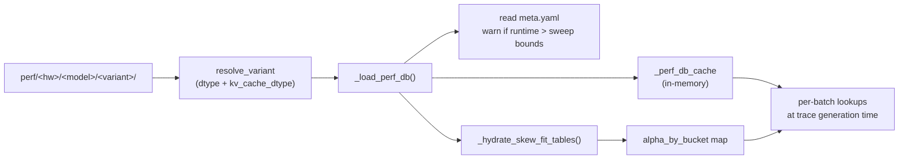

# Output bundle

Each profile run produces a directory tree under
`profiler/perf/<HARDWARE>/<MODEL>/<variant>/`. This is **the contract
between the profiler and the simulator**: anything that lands here
in the right format is consumable by
`trace_generator._load_perf_db()`, regardless of how it was produced.

## Folder layout

```
profiler/perf/<HARDWARE>/<MODEL>/<variant>/
├── meta.yaml
└── tp<N>/                        # one folder per profiled TP degree
    ├── dense.csv
    ├── per_sequence.csv
    ├── attention.csv
    ├── moe.csv                   # MoE models only
    ├── skew.csv                  # skew-enabled runs only
    └── skew_fit.csv              # skew-enabled runs only
```

`<variant>` is auto-named from the dtype combination
(`bf16`, `bf16-kvfp8`, `fp8-kvfp8`, …): see
**[Running → Output naming](./running#output-naming)**. Multiple
variants for the same hardware × model live as siblings.

`tp<N>/` exists for each TP in `TP_DEGREES`. Layers tagged
`tp_stable: true` in the architecture YAML (layernorms, sampler) are
profiled once at TP=1 and **replicated** into other TP folders by the
writer.

## Times are microseconds

All `time_us` columns are in **microseconds**. The simulator
multiplies by 1000 and rounds to nanoseconds at load time. If you're
hand-authoring CSVs (see [Adding non-GPU hardware](./adding-hardware#adding-non-gpu-hardware)),
remember to use μs.

## `dense.csv`

```
layer,tokens,time_us
qkv_proj,128,42.3
qkv_proj,256,79.4
qkv_proj,512,154.2
o_proj,128,38.1
...
```

| Column | Meaning |
| --- | --- |
| `layer` | Canonical layer name (must match the architecture YAML's catalog) |
| `tokens` | `total_len` for this shot |
| `time_us` | Measured kernel latency, microseconds |

The simulator does **1D linear interpolation over `tokens`** when
looking up.

Layers it covers: `embedding`, `layernorm`, `qkv_proj`, `qk_norm`,
`rotary_emb`, `o_proj`, `gate_up_proj`, `act_fn`, `down_proj`,
`final_layernorm`. (Anything in the YAML's catalog with category
`dense`.)

## `per_sequence.csv`

```
layer,sequences,time_us
lm_head,1,18.4
lm_head,4,72.1
lm_head,16,289.2
sampler,1,6.7
...
```

| Column | Meaning |
| --- | --- |
| `layer` | `lm_head` or `sampler` |
| `sequences` | `num_requests` for this shot (decode rounds operate per-sequence) |
| `time_us` | Measured kernel latency |

Simulator: **1D linear interpolation over `sequences`**.

## `attention.csv`

The 4D attention table, covers pure-prefill, pure-decode, and mixed
kernel shapes:

```
prefill_chunk,kv_prefill,n_decode,kv_decode,time_us
0,0,1,128,12.4
0,0,1,256,18.7
0,0,4,128,32.1
512,2048,0,0,184.3
512,2048,4,128,221.6
...
```

| Column | Meaning |
| --- | --- |
| `prefill_chunk` | Tokens of the prefill chunk in this iteration. `0` = pure decode |
| `kv_prefill` | KV cache history length the prefill chunk attends to |
| `n_decode` | Number of concurrent decode requests in this iteration. `0` = pure prefill |
| `kv_decode` | KV cache history length the decode requests attend to |
| `time_us` | Measured attention kernel latency |

Simulator does:

- **Nearest-neighbour** on `(prefill_chunk, n_decode)` (discrete axes)
- **Bilinear interpolation** on `(kv_prefill, kv_decode)` (continuous)

The grid is geometric (doubling by default, controlled by
`ATTENTION_CHUNK_FACTOR` and `ATTENTION_KV_FACTOR`). Smaller values
densify; larger values speed up profiling at some accuracy cost.

## `moe.csv` (MoE models only)

```
tokens,activated_experts,time_us
1,8,4.2
4,8,12.8
8,8,21.4
1,16,7.1
...
```

| Column | Meaning |
| --- | --- |
| `tokens` | Local tokens on a single rank after dispatch |
| `activated_experts` | Distinct experts touched on that rank |
| `time_us` | Measured MoE block latency on a single rank |

Simulator: **2D linear interpolation** on `(tokens, activated_experts)`.
Profiled at **TP=1** only, increasing TP doesn't change the
per-rank expert kernel. The simulator handles `ep_size` by adjusting
expert-to-rank assignment, not by re-profiling.

## `skew.csv` (skew-enabled runs)

Raw heterogeneous-decode shots:

```
regime,n,nb,ratio,skew,pc,kp,kvs,kv_big,kv_mean,t_mean_us,t_max_us,t_skew_us,alpha
mixed,8,1,0.125,4.0,512,2048,512,2048,704,38.2,52.1,40.8,0.187
...
```

The columns capture the raw shape of each bimodal batch and the
three measurements:

| Column | Meaning |
| --- | --- |
| `regime` | `pure` (decode-only) or `mixed` (with prefill chunk) |
| `n` | Total decodes in the batch |
| `nb` | Number of "big" decodes (the outlier KV bucket) |
| `ratio` | `nb / n` |
| `skew` | Ratio of big-KV to small-KV (`kv_big / kvs`) |
| `pc` | Prefill chunk size |
| `kp` | KV history of the prefill chunk |
| `kvs` | Small-decode KV |
| `kv_big` | Big-decode KV (`kvs * skew`) |
| `kv_mean` | `(nb * kv_big + (n-nb) * kvs) / n` |
| `t_mean_us` | Latency at all-decodes-uniform-at-mean kv |
| `t_max_us` | Latency at all-decodes-uniform-at-max kv |
| `t_skew_us` | Latency at the actual bimodal mix |
| `alpha` | `(t_skew - t_mean) / (t_max - t_mean)` ∈ [0, 1] |

Methodology: **[Skew & alpha fit](./skew-alpha-fit)**.

## `skew_fit.csv` (skew-enabled runs)

The fitted per-bucket alpha table the simulator actually consumes
at run time:

```
pc,n_label,skew_rate_label,kv_big_label,kp_label,alpha,n_samples
0,n_8,sr_low,kvb_4096,kp_0,0.21,17
0,n_8,sr_low,kvb_4096,kp_2048,0.24,12
512,n_8,sr_high,kvb_8192,kp_2048,0.62,9
...
```

| Column | Meaning |
| --- | --- |
| `pc` | Prefill chunk bucket (raw value) |
| `n_label` | `n_decode` bucket label |
| `skew_rate_label` | Skew-rate bucket label (normalized [0, 1] scheme) |
| `kv_big_label` | Big-KV bucket (log-4× bins) |
| `kp_label` | `kv_prefill` bucket label |
| `alpha` | Fitted weighted-LS alpha for this bucket |
| `n_samples` | Number of `skew.csv` rows that contributed |

Bucket axis definitions live in `meta.yaml::skew_fit.bucket_axes`,
so widening the profile sweep automatically lights up finer
resolution without any simulator code change.

## `meta.yaml`

Sibling of the `tp<N>/` folders. Three groups of metadata:

```yaml
profiler_version: ...
vllm_version: 0.19.0
gpu: "RTXPRO6000"
profiled_at: "2026-04-30T14:23:11Z"

engine_effective:
  max_num_batched_tokens: 2048
  max_num_seqs: 256
  dtype: bfloat16
  kv_cache_dtype: auto

attention_grid:
  max_kv: 16384
  chunk_factor: 2.0
  kv_factor: 2.0
  chunks: "0, 32, 64, 128, 256, 512, 1024, 2048"
  n_decode: "0, 1, 2, 4, 8, 16, 32, 64, 128, 256"
  kv: "0, 32, 64, ..., 16384"

skew_profile:
  factors:
    n: 2.0
    pc: 2.0
    kp: 2.0
    kvs: 2.0
  grid:
    n: "..."
    ratio: "..."
    pc: "..."
    kp: "..."
    kvs: "..."
    skew: "1.5, 2.0, 4.0, 8.0, 16.0"

skew_fit:
  bucket_axes:
    n_label: ["n_2", "n_4", "n_8", "n_16", "n_32", "n_overflow"]
    skew_rate_label: ["sr_low", "sr_mid", "sr_high"]
    kv_big_label: ["kvb_1024", "kvb_4096", "kvb_16384", "kvb_overflow"]
    kp_label: ["kp_0", "kp_2048", "kp_8192", "kp_overflow"]
  per_tp:
    1:
      method: weighted_ls
      n_samples: 13247
      alpha_default: 0.34
      rel_err_p50: 0.027
      rel_err_p90: 0.148
      rel_err_p99: 0.31
      signed_mean: 0.004
      bucket_table: "tp1/skew_fit.csv"
    2:
      ...
```

The simulator reads:

- `engine_effective`: to warn when runtime values exceed profiled
  bounds (lookups will extrapolate).
- `skew_fit.bucket_axes`: to build the bucket key at run time.
- `skew_fit.per_tp[tp].alpha_default`: fallback when a request's
  bucket isn't in `skew_fit.csv`.
- `attention_grid` and `skew_profile` are informational (not
  consumed by the simulator).

Full bucket → α mapping lives in `tp<N>/skew_fit.csv`. The simulator
hydrates the CSV into an in-memory `alpha_by_bucket` map on first
load.

## How the simulator consumes this



For the simulator-side mechanics, see
**[Simulator → Trace generation](/docs/simulator/trace-generation)**.

## Gotchas

1. **Don't edit CSVs by hand to "tune" simulation results.** The
   simulator interpolates linearly across rows; bogus values produce
   non-monotonic behavior that's hard to debug.
2. **`time_us` is microseconds.** A common mistake when synthesizing
   CSVs from external tools is to put nanoseconds. Triple-check.
3. **Layer names in `dense.csv` must match the architecture YAML.**
   If you add a layer to the YAML and don't profile it, the
   simulator one-shot-warns (and uses 0 latency for that layer,
   silently corrupting results). Re-run profile after YAML edits.
4. **`tp<N>/` folders aren't symlinks.** TP-stable layers are
   physically copied by the writer. Editing `tp1/dense.csv` doesn't
   propagate to `tp2/`.

## What's next

- **[Skew & alpha fit](./skew-alpha-fit)**: methodology behind
  `skew.csv` and `skew_fit.csv`.
- **[Adding non-GPU hardware](./adding-hardware#adding-non-gpu-hardware)**
  synthesize this CSV bundle from your own measurement source.
