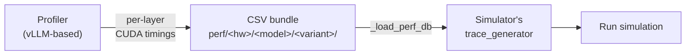

import IconCardGrid from '@site/src/components/IconCardGrid';
import {Cpu, Settings, FileText, Activity, Plug, BookOpen} from 'lucide-react';

# Profiler

The profiler is a **vLLM-based layerwise profiler**. It drives a real
vLLM engine with synthetic batches and records per-layer CUDA kernel
latencies into per-category CSV files. Those CSVs are exactly what
the simulator's `trace_generator` reads at run time, the profiler's
output IS the simulator's input.

## When you need to run it

You **don't** need to run the profiler if your hardware × model
combination is already in the bundled profile data. Otherwise:

| Scenario | Profile? |
| --- | --- |
| Running a bundled `(hardware, model)` combo (e.g., RTXPRO6000 + Llama-3.1-8B) | No, just simulate |
| New GPU (e.g., H100, A100) with a bundled model | Yes, see [Adding new hardware](./adding-hardware) |
| Bundled GPU with a new model (`Mistral-7B`, `Phi-3.5-MoE`, …) | Maybe, see [Adding model architecture](./adding-model-architecture) |
| Non-GPU accelerator (TPU, custom NPU) | Yes, but a different workflow, see [Adding non-GPU hardware](./adding-hardware#adding-non-gpu-hardware) |

## What it produces

For each `(hardware, model, variant)` profiled, the profiler writes a
folder under `profiler/perf/<hardware>/<model>/<variant>/` with one
`tp<N>/` subfolder per profiled tensor-parallel degree:

```
perf/<hardware>/<model>/<variant>/
├── meta.yaml                       # engine flags, sweep specs, skew_fit summary
└── tp<N>/
    ├── dense.csv                   # token-count → latency
    ├── per_sequence.csv            # seq-count → latency
    ├── attention.csv               # 4D: (pc, kv_pre, n_dec, kv_dec) → latency
    ├── moe.csv                     # MoE only: (tokens, experts) → latency
    ├── skew.csv                    # raw heterogeneous-decode shots
    └── skew_fit.csv                # fitted per-bucket alpha table
```

Times are stored in **microseconds** (`time_us` column); the
simulator multiplies by 1000 and rounds to ns at load time.

Schema details on **[Output bundle](./output-bundle)**.

## How it fits the bigger picture



The profiler runs on the **vLLM Docker container** (or bare metal via
`scripts/install-vllm.sh`). The simulator runs on the **simulator
container** (`astrasim/tutorial-micro2024`). They share the
`profiler/perf/` directory, that's the only thing they exchange.

## Bundled profile data

| Hardware | Models profiled | Variants |
| --- | --- | --- |
| `RTXPRO6000` | `meta-llama/Llama-3.1-8B`, `Qwen/Qwen3-32B`, `Qwen/Qwen3-30B-A3B-Instruct-2507` | `bf16`, `bf16-kvfp8` |

If your `(hardware, model, variant)` combo is in this table, you can
skip the profiler entirely.

## Prerequisites

- **vLLM Docker container** running at `/workspace` (mounts repo
  root). See **[Installation → vLLM setup](/docs/getting-started/installation/vllm)**.
- **NVIDIA GPU** (only for the profiler, the simulator runs on CPU).
- **`HF_TOKEN`** environment variable for gated model configs (Llama
  3.x, etc.). Set this in `scripts/docker-vllm.sh` before launching.
- **A few GB of GPU memory** for the model variant you're profiling
  (TP=1 needs the full model; TP=N needs `model_size / N`).

## Where to go next

<IconCardGrid columns={3} cards={[
  {
    Icon: Settings,
    title: 'Running',
    description: 'Edit profile.sh, pick options for your sweep, hit go.',
    to: '/docs/profiler/running',
  },
  {
    Icon: FileText,
    title: 'Output bundle',
    description: 'Schema reference for every CSV the profiler emits.',
    to: '/docs/profiler/output-bundle',
  },
  {
    Icon: Activity,
    title: 'Skew & alpha fit',
    description: 'How the heterogeneous-decode correction is profiled and fit.',
    to: '/docs/profiler/skew-alpha-fit',
  },
  {
    Icon: Plug,
    title: 'Adding new hardware',
    description: 'GPU (vLLM-supported) or non-GPU (TPU, custom accelerator).',
    to: '/docs/profiler/adding-hardware',
  },
  {
    Icon: BookOpen,
    title: 'Adding a model architecture',
    description: 'When to write a new architecture YAML, and what to put in it.',
    to: '/docs/profiler/adding-model-architecture',
  },
]} />
