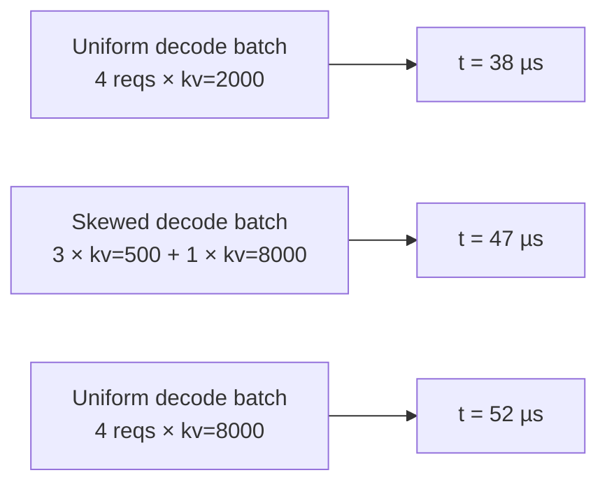

# Skew & alpha fit

The uniform attention sweep (`attention.csv`) profiles batches where
all decodes share one KV length. Real serving doesn't look like
that, every iteration mixes long-running requests at high KV with
freshly-arrived ones at low KV. FlashAttention's varlen kernel pays
a real penalty for that heterogeneity (tile-padding + SM-imbalance),
which the uniform grid can't see.

The skew sweep + alpha fit is how the simulator gets that penalty
right.

## The problem in one picture



Three batches with the same `n=4` decodes and the same **mean** KV
of 2000 (left and middle) or **max** KV of 8000 (middle and right).
The middle batch's latency lands between the two uniform reference
points, but where, exactly, depends on how skewed the KV
distribution is.

The naive interpolation `t = t(mean_kv)` underestimates the skewed
case (38 µs predicted vs. 47 µs actual). Using `t(max_kv)` would
overestimate (52 µs vs. 47 µs).

## The fix: blend two lookups using a per-bucket alpha

For every shape of skewed batch, we measure the actual latency
**plus** what the uniform-mean and uniform-max latencies would be at
the same shapes. Three numbers per shot:

| Symbol | Batch shape |
| --- | --- |
| `t_mean` | Same `n`, all decodes uniform at the batch's **mean** kv |
| `t_max` | Same `n`, all decodes uniform at the batch's **max** kv |
| `t_skew` | The actual bimodal mix: `nb` decodes at `kv_big` + `(n - nb)` decodes at `kvs` |

From these three:

```
alpha = (t_skew - t_mean) / (t_max - t_mean)   ∈ [0, 1]
```

Alpha is a **normalized position on the t_mean → t_max line**:

- `alpha = 0` → no penalty; skewed batch behaves like uniform-mean.
- `alpha = 1` → full penalty; skewed batch behaves like uniform-max.
- typical values: 0.2–0.5.

At simulation time, the lookup becomes:

```
t_predicted = t_mean_lookup(batch.kv_decode_mean)
            + alpha(batch.shape) × (t_max_lookup(batch.kv_decode_max)
                                    - t_mean_lookup(batch.kv_decode_mean))
```

The simulator does **two** 4D attention lookups and blends them.
That's `_lookup_attention_with_skew` in `serving/core/trace_generator.py`.

## Sweep structure (`skew.csv`)

The skew sweep produces `skew.csv` rows in two tiers:

### Tier 1, factorial over (n, ratio, pc, kp, kvs)

A factorial sweep at one representative skew factor (`_SKEW_REP =
4.0`). Provides the bulk of the rows and covers every
`(pc, n_bin, kv_big_bin, kp_bin, skew_rate_bin)` cell the fit
discriminates on.

Per axis:

- `n` ∈ unique values up to `MAX_NUM_SEQS`
- `ratio = nb / n` ∈ a few sample fractions
- `pc` ∈ prefill chunk grid (including 0 = pure decode)
- `kp` ∈ prefill-history grid
- `kvs` ∈ small-kv grid
- `skew` = 4.0 (fixed)

### Tier 2, skew-axis sweep at anchor pivots

At a handful of anchor pivots (a fixed subset of Tier-1 cells), Tier
2 sweeps `skew ∈ {1.5, 2.0, 4.0, 8.0, 16.0}`. This is the only
source of rows with `skew ≠ 4.0`; covers how `alpha` saturates as
the outlier KV stretches.

Tier 2 catches the "very long context decode joins a short-context
batch" failure mode that Tier 1 alone would miss.

## Density knobs

All five axes are user-controllable via per-axis geometric factors
in `profile.sh` (defaults `2.0` = doubling):

| Variable | Axis | Profiling time impact |
| --- | --- | --- |
| `SKEW_N_FACTOR` | `n` | doubling halves the shots |
| `SKEW_PC_FACTOR` | `pc` | same |
| `SKEW_KP_FACTOR` | `kp` | same |
| `SKEW_KVS_FACTOR` | `kvs` | same |

The skew sweep fires **3 shots per case** (`t_mean`, `t_max`,
`t_skew`), so coarsening compounds quickly. Bumping any factor to
`4.0` quarters the shots on that axis; `8.0` does it again.

The effective values land in `meta.yaml::skew_profile.factors`.

## The fit (`skew_fit.csv`)

Raw `skew.csv` rows are too granular to query at runtime, millions
of `alpha`s, none of which match a runtime batch shape exactly. The
post-process fit groups rows into **buckets** along five axes and
runs a weighted least-squares fit per bucket.

### The 5-axis bucket key

| Axis | Bucket scheme |
| --- | --- |
| `pc` | One bucket per unique `pc` value (raw) |
| `n_label` | One bucket per unique `n` value (`n=0` sentinel + overflow) |
| `skew_rate_label` | Fixed normalized [0, 1] scheme, `sr_low`, `sr_mid`, `sr_high` |
| `kv_big_label` | log-4× bins extended to observed max, `kvb_1024`, `kvb_4096`, `kvb_16384`, `kvb_overflow` |
| `kp_label` | One bucket per unique `kp` value + overflow |

The bucket axis definitions are written to
`meta.yaml::skew_fit.bucket_axes` so the simulator builds the same
bucket key at lookup time. Widening the profile sweep automatically
lights up finer resolution without simulator code changes.

### Storage

- `skew_fit.csv`: full per-bucket alpha mapping. ~1000–5000 rows
  for a typical sweep.
- `meta.yaml::skew_fit.per_tp[tp]`: summary per TP:
  `method`, `n_samples`, `alpha_default`, `rel_err_p50/p90/p99`,
  `signed_mean`, plus a `bucket_table` pointer at
  `tp<N>/skew_fit.csv`.

This split keeps `meta.yaml` to ~100 lines per variant instead of
~3000+.

### Fit accuracy on the bundled profiles

Validation results from the RTXPRO6000 sweep on the bundled models:

| TP | n_samples | rel_err_p50 | rel_err_p90 | rel_err_p99 |
| --- | --- | --- | --- | --- |
| TP=1 | ~13 k | 2.7% | 14.8% | 31% |
| TP=2 | ~12 k | 3.5% | 16.4% | 32% |

p50 and p90 are the relative error of the fitted alpha vs. the
measured alpha across held-out shots. The numbers are
indistinguishable from the previous 3-axis fit at p50 but ~10%
better at p90, because the 5-axis bucket scheme captures the
`(skew_rate, kv_big)` interaction Tier 2 surfaces.

## Skip / refresh modes

| Variable | Effect |
| --- | --- |
| `SKIP_SKEW=1` | Skip the entire skew step. No `skew.csv` or `skew_fit.csv` produced. The simulator falls back to a **pooled constant alpha** at run time |
| `ONLY_SKEW=1` | Run only the skew step, leaving `dense / per_seq / attention / moe` untouched. Useful for refreshing skew after axis-density changes |

The pooled constant alpha fallback is roughly 0.3 across observed
hardware. Without skew correction, predictions skew (heh) low by
single-digit percent on heterogeneous-decode workloads, usually
fine for first-pass sanity checks.

## Gotchas

1. **`skew_fit.csv` is bucket-keyed**, not raw-shape-keyed. A
   runtime batch with no matching bucket falls back to
   `alpha_default`. If your workload pushes shapes outside the
   profiled grid, expect `alpha_default` to dominate, re-profile
   with wider grid bounds.
2. **`alpha < 0` or `alpha > 1` are clipped at fit time.**
   Measurement noise occasionally produces out-of-range raw alphas
   from a single shot; the fit ignores them.
3. **Skew correction only fires for non-trivial batches.** Pure
   prefill (`n_decode == 0`) and pure-uniform decode batches don't
   need correction, the uniform grid is already correct.
4. **MoE doesn't get skew correction.** The simulator's skew path is
   attention-specific. MoE per-rank latency is read directly from
   the 2D `(tokens, activated_experts)` table.

## What's next

- **[Output bundle → `skew_fit.csv`](./output-bundle#skew_fitcsv-skew-enabled-runs)**
  column-by-column reference.
- **[Simulator → Trace generation](/docs/simulator/trace-generation#heterogeneous-decode-skew-correction)**
  how the alpha is applied at simulation time.
