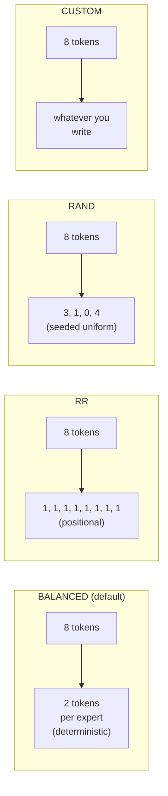

# MoE expert routing

For Mixture-of-Experts models, every token visiting an MoE layer
needs an answer to two questions: **which experts do I activate** and
**which EP rank holds them**. The first is the model's gate
function; the second is determined by how the simulator assigns
experts to ranks. This page is about both.

> Configuration angle (`--expert-routing-policy` flag, when to use
> which) is on **[Examples → Expert parallel](/docs/examples/parallelism/expert-parallel)**.
> This page is the internal mechanics.

## The piece that does it: `GateRouter`

`serving/core/gate_function.py` defines `GateRouter`. The trace
generator instantiates one per simulation; on every MoE block it
calls:

```python
GateRouter(
    num_local_experts=N,           # total experts in the model
    num_experts_per_token=K,       # top-K activations per token
    routing_policy='BALANCED',     # one of 4 policies, see below
    seed=42,
    block_copy=True,
)

result = router.route(num_tokens=T, tp_rank=r, num_experts_per_token=K)
# → RoutingResult(local_tokens=[...], activated_experts=[...], source_tokens=[...])
```

`local_tokens[i]` is the number of tokens assigned to EP rank `i`
after dispatch. `activated_experts[i]` is the count of distinct
experts touched on that rank. Both feed into the per-rank attention/MLP
latency lookup.

## Four policies



| Policy | Determinism | What it models | When to use |
| --- | --- | --- | --- |
| **BALANCED** (default) | Deterministic | Idealized load-balanced gate (post-aux-loss training) | Most research baselines |
| **RR** | Deterministic | Pure round-robin assignment | Sanity / null-baseline runs |
| **RAND** | Seeded random | Uniform random per token | Worst-case load imbalance studies |
| **CUSTOM** | Plug-in | Whatever you write | Real trained gate weights, ablation |

### BALANCED, closed-form pigeonhole

BALANCED computes the *exact* token distribution that a perfectly
load-balanced gate would produce: for `T` tokens and `E` experts with
top-`K`, each expert gets `T*K/E` tokens (with the remainder split
deterministically across experts to round to integers).

This is what a model with a well-trained auxiliary load-balancing
loss converges to in expectation. It's the simulator's default
because:

1. Real production MoE deployments use auxiliary losses → balanced
   distribution is the realistic baseline.
2. It's deterministic, so simulations are reproducible.
3. It enables the **block copy** optimization (see below).

### RR, round-robin

Token *t* goes to expert `t % num_local_experts`. Same expert each
forward, regardless of token content. Useful as a sanity check or
when you want a "no smart routing" baseline; produces identical
per-rank token counts to BALANCED in expectation.

### RAND, random

Per-token uniform random across experts (using `seed=42` by default
for reproducibility). Produces realistic worst-case load imbalance
- some ranks see more tokens than others, which is what an
*untrained* gate produces. Use this if you want to study the cost of
load imbalance specifically.

### CUSTOM, plug-in

Edit `gate_function.py::GateRouter._custom_routing`. The hook
receives the token list and returns expert assignments per token.
Use this if you want to drive routing from real trained gate weights
or a learned-from-trace model.

## Expert-to-rank assignment

Whatever policy decides "token T goes to expert E", the simulator
also has to know "expert E lives on which rank". This uses **even
partitioning**:

```
rank_for_expert(e) = e * ep_size // num_experts
```

So with 128 experts and `ep_size=2`, experts 0–63 live on rank 0 and
64–127 on rank 1. With `ep_size=4`, each rank holds 32 experts.

The `GateRouter.route()` output collapses per-token assignments into
per-rank token counts that ASTRA-Sim consumes through the trace's
`EXPERT {i}` markers.

## `block_copy`: what it means and when it's safe

By default, `block_copy=True`. The trace generator emits the full
trace for **only the first transformer block** and replays it
across all blocks via a single `block_copy` Chakra instruction.

This is **safe** for:

- Dense models (no MoE, all blocks identical).
- MoE with `BALANCED` (every block routes the same way, since
  BALANCED is deterministic and stateless).

It's an **approximation** for:

- MoE with `RR` (alternating round-robin position differs per layer,
  in practice the per-rank counts are still nearly identical).
- MoE with `RAND` (per-block randomness produces variance the copy
  can't capture).
- MoE with `CUSTOM` (depends entirely on what you wrote).

For research where per-block variance matters, set
`enable_block_copy=False` in the trace generator (or pick a policy
where block_copy is auto-disabled). Simulation runs more slowly but
generates per-block traces.

## Per-rank latency lookup

Every rank's MoE block latency comes from
`profiler/perf/<hw>/<model>/<variant>/tp1/moe.csv` keyed on:

| Key | Meaning |
| --- | --- |
| `local_tokens` | Tokens assigned to this rank after dispatch |
| `activated_experts` | Number of *distinct* experts this rank touches |

Profiled at TP=1 (no tensor splitting in MoE, per-expert weights are
already small). Simulator does 2D linear interpolation across the
two axes.

The full MoE block latency is then **max(rank_latencies)** because
ranks execute in parallel and synchronize at the ALLTOALL barrier.
Whichever rank gets the most tokens × experts dominates.

## What ALLTOALL costs surround the MoE block

Each MoE block in the trace is sandwiched between two
ALLTOALL collectives:

```
input_residue → dispatch ALLTOALL → expert compute → combine ALLTOALL → output_residue
```

- **Dispatch ALLTOALL**: routes input activations from each rank's
  TP shard to the rank holding their assigned expert.
- **Combine ALLTOALL**: gathers expert outputs back to the
  originating ranks.

Both have `comm_size = total_len * hidden_size * fp_size` (full
activation tensor; ASTRA-Sim divides per rank).

For **DP+EP** topologies, the `comm_size` is synchronized to the max
across the DP group, see
**[Parallelism mechanics](./parallelism-mechanics)**.

## Gotchas

1. **`block_copy` defaults to True** and silently produces an
   approximation for non-BALANCED policies. If you're studying load
   imbalance specifically, disable it.
2. **`activated_experts` is per-rank, not per-token.** A rank with
   100 tokens hitting 8 distinct experts reports `activated_experts
   = 8`, not 800. The latency lookup expects this convention.
3. **MoE is profiled at TP=1.** Increasing `tp_size` doesn't change
   the MoE CSV path. Splitting expert weights happens via `ep_size`,
   which the simulator handles by adjusting the rank-to-expert
   mapping, not by re-profiling.
4. **`num_experts_per_tok` (top-K)** is read from the model's HF
   config. Deviating from the trained value is OK at simulation time
   but won't match the real model's behavior.
5. **Dummy batches in DP groups still route through the gate.**
   1-token dummy batches go through routing exactly like real
   batches, so DP+EP results are consistent across waves.

## What's next

- **[Parallelism mechanics](./parallelism-mechanics)**: what the
  ALLTOALLs around the MoE block look like at the network level.
- **[Examples → Expert parallel](/docs/examples/parallelism/expert-parallel)** -
  the configuration angle (when to use which `ep_size`).
- **[Examples → DP+EP MoE](/docs/examples/parallelism/dp-ep-moe)** -
  multi-instance MoE.
