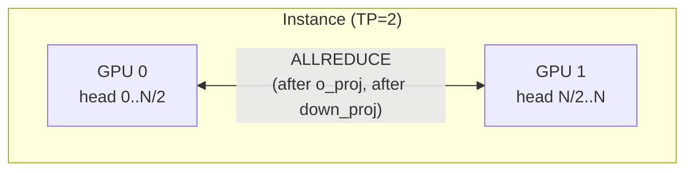
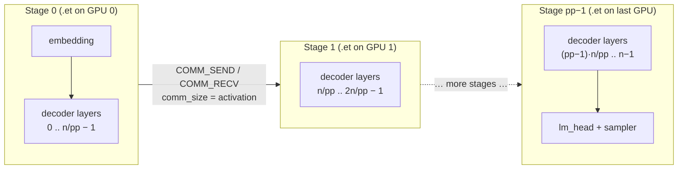
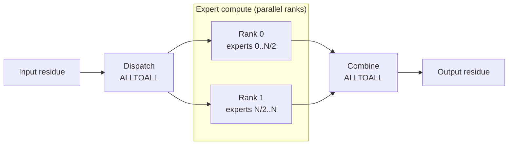
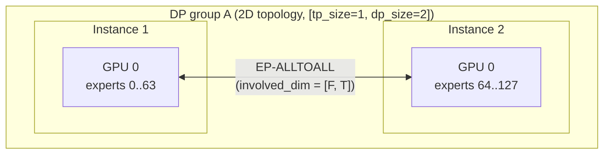
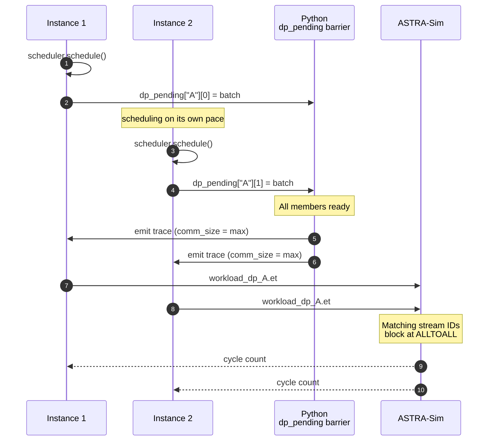

# Parallelism mechanics

This page is the **runtime** side of parallelism: when a batch hits
ASTRA-Sim, what collectives fire, where, and how multi-instance DP
groups synchronize. The cluster-config angle (which fields turn each
of these on) is on
**[Examples → Cluster config explained](/docs/examples/cluster-config-explained)**.

## What the simulator can model

| Style | What's parallelized | Collective | Where it fires |
| --- | --- | --- | --- |
| **TP** (tensor) | Linear weights split along head dim | ALLREDUCE | After `o_proj` and `down_proj` |
| **PP** (pipeline) | Decoder layers split across GPU groups | (point-to-point in `inflight` queue) | At stage boundaries |
| **EP** (expert) | MoE experts split across ranks | ALLTOALL | Around the MoE block |
| **DP+EP** | EP across multiple instances | ALLTOALL | Same, but across instance boundaries with wave-sync |

TP and EP can share the same GPUs. DP+EP requires a `dp_group`
identifier on the cluster config.

## TP, ALLREDUCE on every dense layer



When `tp_size > 1`, the trace generator attaches an ALLREDUCE
`COMM_COLL_NODE` after each TP-aware dense linear:

- `o_proj` (attention output projection)
- `down_proj` (MLP output projection)

These are the two layers where each TP rank holds a different head
slice of the output and needs to sum across ranks.

The `comm_size` on each ALLREDUCE is the full output tensor size
(not per-rank, ASTRA-Sim divides internally based on
`nodes_in_ring`).

`qkv_proj`, `gate_up_proj`, etc. don't need ALLREDUCE because they
*split* the input along the head dim, those layers' output is
already correctly sharded for the next layer. TP's collective cost
is bound by `o_proj` + `down_proj`, two ALLREDUCEs per decoder block.

## PP, pipeline stages and `inflight`



When `pp_size > 1`, the scheduler keeps an `inflight` list capped at
`pp_size` entries. When the pipeline is full, `schedule()` returns
`None` and waits for ASTRA-Sim to drain a stage, the same
back-pressure pattern as Megatron-style 1F1B.

The trace header is stamped with `model_parallel_NPU_group: {pp_size}`.
Chakra's `llm_converter.py` partitions the per-iteration layer list
into `pp_size` contiguous groups (`layers_per_group = num_layers //
pp_size`) and emits one `.et` per NPU. At each stage boundary it pairs
a `COMM_SEND_NODE` on the upstream NPU with a matching
`COMM_RECV_NODE` on the downstream one, sized by the boundary
activation tensor.

Inter-stage P2P latency (link bandwidth, hop count, contention) is
therefore part of the reported iteration time, and pipeline overlap
between in-flight batches falls out from each NPU's independent `.et`
schedule.

## EP, ALLTOALL around the MoE block



For MoE models, `trace_generator` wraps the MoE block with two
ALLTOALL collectives:

```
... → MoE dispatch ALLTOALL → expert compute → MoE combine ALLTOALL → ...
```

The dispatch ALLTOALL routes each token to its assigned expert's
rank. The combine ALLTOALL gathers expert outputs back to the
originating ranks. Both are scoped to the EP dimension.

Each EP rank gets a per-rank latency from
`profiler/perf/<hw>/<model>/<variant>/tp1/moe.csv` keyed on its
**local** token count (after dispatch) and the **activated experts**
per token. Ranks execute in parallel and synchronize at the ALLTOALL
barrier, slower ranks gate the others.

Token routing decisions come from `gate_function.py`. See
**[MoE expert routing](./moe-expert-routing)** for the policies.

## DP+EP, wave synchronization





This is where the simulator gets clever. When two or more instances
share a `dp_group`, they form a single coordinated wave. Two
synchronization mechanisms work together:

### 1. Python-side `dp_pending` barrier

In `__main__.py`, a `dp_pending` dict tracks which DP-group members
have scheduled their batches for the current wave. Trace generation
is **deferred** until all members have scheduled. When the last
member arrives:

- The simulator computes `dp_sum_total_len = sum(total_len)` and
  `dp_max_total_len = max(total_len)` across the group.
- `comm_size_alltoall` is set to
  `dp_max_total_len * hidden_size * fp_size`: the *max* across the
  group, matching CUDA-graph padding in production MoE serving.
- All members generate their traces with the same `comm_size`, even
  if their per-instance `total_len` differs.

If one DP member has no pending requests, the scheduler synthesizes a
**dummy batch** (1 decode token) so the wave still runs. When
all of one member's real requests have finished but the others
haven't, the dummy batches keep flowing until the whole group is
done.

### 2. ASTRA-Sim ALLTOALL barrier

All DP-group instances' `.et` files share the same workload folder
(`dp_<group>_batch<bid>/llm.et`) and use **matching stream IDs** on
the ALLTOALL collectives. ASTRA-Sim's runtime sees the matching IDs
and blocks until both NPUs reach the collective, naturally
implementing the wave-sync at the network layer.

So both halves of the sync, Python deferral on submission, ASTRA-Sim
blocking on the collective, together produce a deterministic
wave-synchronous schedule.

## 2D ASTRA-Sim topology and `involved_dim`

`config_builder` generates a 2D ASTRA-Sim network when DP groups are
present. The topology is `npus_count: [tp_size, dp_group_size]`.
Collectives are scoped per dimension via the `involved_dim` BoolList
on each `COMM_COLL_NODE`:

- **TP-ALLREDUCE:** `involved_dim = [True, False]`: dim 0 only.
- **EP-ALLTOALL:** `involved_dim = [False, True]`: dim 1 only when
  EP spans the DP group; `[True, True]` if EP also spans TP.

The `involved_dim` is encoded in the trace's `comm_type` field with
a `:dim0,dim1` suffix:

```
ALLREDUCE:1,0     # TP only
ALLTOALL:0,1      # EP across DP only
```

The Chakra converter parses this via `_parse_comm_type` and writes
the BoolList into the `.et` file. ASTRA-Sim's `Workload::issue_comm`
reads it and dispatches the collective only on the involved dims.

The `system.json` collective implementations need one entry per
topology dim, `config_builder` generates this automatically:
`"all-to-all-implementation": ["ring", "ring"]` for 2D.

## Communication sizes (ASTRA-Sim semantics)

Every `comm_size` in the trace is the **total** data size, not
per-NPU. ASTRA-Sim divides internally by the number of nodes in the
ring (`msg_size = data_size / nodes_in_ring`).

So:

- ALLREDUCE on `o_proj`: pass the **full output tensor size**
  (`total_len * hidden_size * fp_size`).
- ALLTOALL for MoE: pass the **full activation tensor size**
  (`total_len * hidden_size * fp_size`).

If you see surprisingly fast collectives in your trace logs, check
that you're not accidentally passing per-rank sizes, that's a
common mistake when extending the trace generator.

## When to use which

A rough decision tree (the *configuration* angle is on
[Examples → Cluster config explained](/docs/examples/cluster-config-explained)):

- **Single GPU fits the model:** TP=1. Done.
- **Need more GPUs for memory:** start with TP. ALLREDUCE cost grows
  with `tp_size`, so going past 4-8 is rarely worth it.
- **Multiple replicas for throughput:** add `num_instances` (no
  `dp_group`). Independent instances behind a router.
- **MoE model, single instance:** add `ep_size = tp_size`. Same GPUs,
  EP-ALLTOALL replaces TP-ALLREDUCE on the MoE block.
- **MoE, want to scale experts past one instance's GPUs:** DP+EP
  with `dp_group` set. EP spans instances via wave-sync.

## Gotchas

1. **`ep_size > tp_size` requires `dp_group`.** Otherwise the cluster
   config builder rejects the spec. EP needs the 2D topology to scale
   beyond a single instance's GPU count.
2. **Dummy batches are real ASTRA-Sim work.** A DP group with one
   idle instance still pays the ALLTOALL cost on the dummy batch.
   This is what production looks like, wave-sync is wave-sync.
3. **`comm_size` is synchronized to the max.** Even if one DP
   member's batch is much smaller, the ALLTOALL message size matches
   the largest member's. This is *correct* (matches production
   padding) but worth knowing.
4. **PP models inter-stage forwarding via send/recv, not via
   micro-batch splitting inside an iteration.** Activation shipment
   between stages goes through ASTRA-Sim send/recv (so link bandwidth
   and contention show up in the result), but a single iteration is
   not chunked into multiple micro-batches — the overlap benefit
   comes from running up to `pp_size` consecutive iterations
   simultaneously. There's also no knob to pick a pipeline schedule
   (1F1B, interleaved, etc.).

## What's next

- **[MoE expert routing](./moe-expert-routing)**: how tokens get
  distributed across EP ranks before the dispatch ALLTOALL.
- **[Examples → DP+EP MoE](/docs/examples/parallelism/dp-ep-moe)** -
  a worked-out config that exercises this whole machinery.
