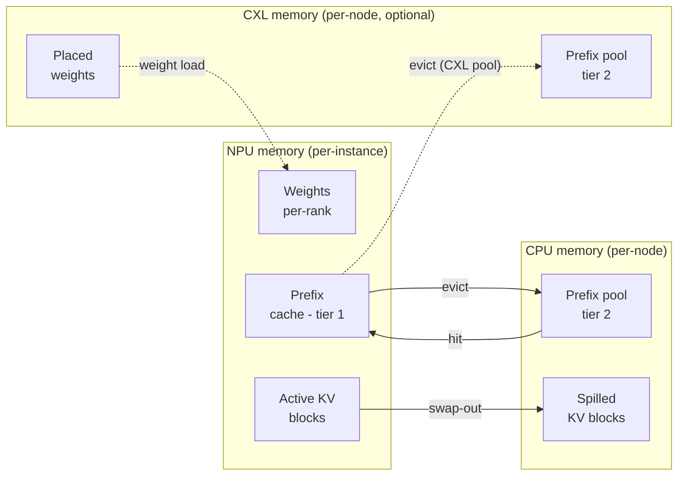

# KV cache & memory

Each `Scheduler` owns a `MemoryModel` that tracks how many bytes of
NPU and CPU (and optionally CXL) memory are in use at any moment.
This is what tells the scheduler when to stop accepting new requests
and what triggers prefix-cache evictions.

> Looking for memory-tier *configuration*? See
> **[Examples → CXL extended memory](/docs/examples/memory-tiers/cxl-memory)**
> for placement rules and
> **[Examples → Prefix caching](/docs/examples/memory-tiers/prefix-caching)**
> for the second-tier pool. This page is the byte-accounting side.

## Memory tiers



Three tiers, each represented by a separate counter on the
`MemoryModel`:

| Tier | Object | Capacity from | Holds |
| --- | --- | --- | --- |
| **NPU** | `npu_used` | `npu_mem.mem_size` × `num_npus` | Weights (per-rank), active KV cache, NPU prefix cache |
| **CPU** | `cpu_used` | `cpu_mem.mem_size` (per node) | CPU prefix pool, evicted KV blocks, model weight staging |
| **CXL** *(optional)* | `cxl_used[device_id]` | `cxl_mem.mem_size` × `num_devices` | CXL-resident weights / KV / prefix pool depending on placement |

Capacity comes from the cluster config; usage is tracked at runtime.
Exceeding capacity at startup (e.g., `weight_per_gpu > npu_mem`) is
a fatal error. Exceeding it at runtime triggers eviction (for the
prefix cache) or scheduler back-pressure (for active KV).

## What's in NPU memory

Two big consumers, in this order of priority:

### 1. Model weights (per-GPU)

Computed at scheduler init via
`MemoryModel.get_weight()`. The size is the model's full parameter
count divided by `tp_size` (and for MoE: experts further divided by
`ep_size`), times the dtype byte size:

```
weight_bytes_per_gpu = (
    dense_params / tp_size
    + moe_params / ep_size  # if MoE
) * fp_size_in_bytes
```

`fp_size` is 2 bytes for `bfloat16` / `float16`, 4 for `float32`,
1 for `int8` and `fp8`. Actually loading is done via `get_weight()`,
which reads the model config and accounts for shared embeddings,
tied weights, etc.

This bytes amount is reserved on every NPU at startup and never
freed. If `weight_per_gpu > npu_mem.mem_size`, the simulator exits
with a clear error message, the typical fix is to bump `tp_size`,
add CXL placement rules, or pick a smaller model.

### 2. Active KV cache

Per-request KV cache, tracked at block granularity. The block size
is `--block-size` tokens (default 16):

```
bytes_per_block = (
    2                                         # K and V
    * num_layers
    * num_key_value_heads / tp_size           # GQA shards by TP
    * head_dim
    * block_size
    * kv_fp_size
)
```

Where `kv_fp_size` is:

- 2 bytes for `--kv-cache-dtype auto` (inherits from `--dtype`).
- **1 byte for `--kv-cache-dtype fp8`**: halves KV memory.

The scheduler reserves `ceil(tokens / block_size)` blocks per active
request and frees them when the request completes (or when chunked
prefill / prefix caching has different lifecycle, see below).

### 3. NPU prefix cache

A subset of the active KV blocks that the prefix cache keeps around
even after their original requests finish. When a new request walks
into the cache and matches a stored prefix, those blocks are
"reactivated", added back to active KV without recomputation.

Eviction happens when NPU memory pressure forces it: the prefix
cache is the first thing to release blocks. If the CPU or CXL
second-tier pool exists, evicted blocks **spill** there rather than
disappearing.

Full mechanics: **[Prefix caching](./prefix-caching)**.

## What's in CPU / CXL memory

Per-node CPU memory (and per-device CXL memory) hold:

- The shared **second-tier prefix cache** if
  `--enable-prefix-sharing` is on.
- **Spilled KV blocks** from NPU evictions (when offloading is
  enabled).
- **Weights placed there explicitly** via the `placement` field in
  the cluster config (e.g., `"weights": "cxl:0"` for some decoder
  blocks on CXL device 0). See
  **[Examples → CXL memory](/docs/examples/memory-tiers/cxl-memory)**
  for the placement rule syntax.

Unlike NPU memory, CPU/CXL accounting is **per node**, not per
instance. Multiple instances on the same node share the same
`cpu_used` counter.

## How the scheduler uses this

Every iteration, before adding a request to the batch, the scheduler
estimates the memory it would consume:

```python
new_kv_blocks_needed = (request.num_computed_tokens
                       + tokens_to_run_this_step
                       - already_reserved_blocks * block_size) / block_size
new_kv_bytes = new_kv_blocks_needed * bytes_per_block
if memory.npu_used + new_kv_bytes > npu_mem_total:
    # try eviction; if still doesn't fit, skip this request
```

If the prefix cache can free enough blocks via eviction, the request
runs and the cache loses some entries. Otherwise, the scheduler
**skips** this request and tries the next one in the queue. The
deferred request stays in the queue and is retried on the next
iteration.

This is what produces the bursty memory-usage pattern you see in
long-context workloads: the cache fills, evicts, refills, and the
scheduler's effective batch size oscillates with available memory.

## Per-instance vs per-node accounting (gotcha)

The `npu_used` and the NPU prefix cache are **per-instance**. Two
instances on the same node have completely separate NPU accounting,
even though they're on the same physical GPU.

`cpu_used` is **per-node**. Two instances on the same node share one
CPU memory budget. If both have spilled prefix blocks to CPU, they
compete for the same `cpu_mem.mem_size` capacity.

This matters for multi-instance configs: `num_instances: 4` with
each instance reserving 60 GB of NPU memory implies each instance
gets its own GPU; but they all share the node's `cpu_mem.mem_size`
GB of host memory.

## Reading memory in the throughput log

The throughput log line emitted every `--log-interval` seconds shows
running memory usage:

```
[INFO] step=42 batch=8 prompt_t=1.2k tok/s decode_t=420 tok/s
       npu_mem=88.4 GB cpu_mem=12.4 GB
```

For multi-instance setups it lists per-instance NPU usage:

```
       npu_mem=[88.4 GB, 87.9 GB] cpu_mem=24.8 GB
```

If you're using CXL:

```
       npu_mem=12.4 GB cxl_mem=[3.2 GB, 3.1 GB, 3.1 GB, 3.2 GB]
```

(`12.4 GB` is the surviving NPU active KV + cache, with weights now on
CXL.)

## Gotchas

1. **OOM at startup** is always a weights-vs-NPU-capacity issue. The
   error message points at exact byte counts; bump `tp_size` or
   reduce model size.
2. **OOM mid-run** is unusual but possible if CXL placement is
   misconfigured. Check the per-device CXL counter in the throughput
   log.
3. **`block_size` matters for memory granularity, not throughput.**
   Smaller blocks = finer accounting but more overhead per request.
   Default 16 is what vLLM uses.
4. **FP8 KV cache halves the KV byte budget**, but you also need a
   profile bundle for the `*-kvfp8` variant
   (e.g., `bf16-kvfp8`). Without it, the simulator errors out with a
   variant-not-found message.
5. **Weight memory is fixed for the run.** It doesn't grow when you
   add more requests; only KV cache does. The "weight ceiling"
   visible at the top of the throughput log line stays constant.

## What's next

- **[Trace generation](../trace-generation)**: how the latency for
  each iteration is calculated *given* a memory state.
- **[Examples → Prefix caching](/docs/examples/memory-tiers/prefix-caching)**
  and **[CXL memory](/docs/examples/memory-tiers/cxl-memory)**: the
  configuration angle.
