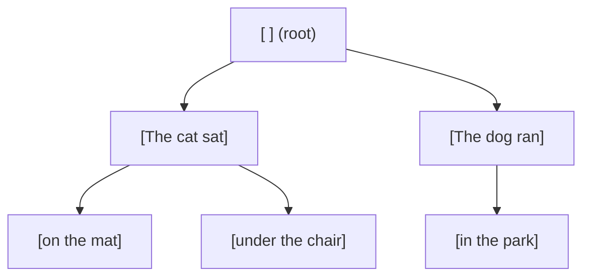
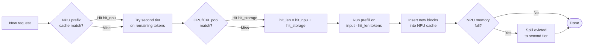

# Prefix caching

Prefix caching is the simulator's RadixAttention implementation
(adapted from [SGLang](https://github.com/sgl-project/sglang)). When
two requests share a common token prefix, the second one's prefill
work for that prefix can be skipped entirely, the KV blocks computed
for the first request are reused.

> Looking for "how do I enable it" / "what flags should I set"?
> See **[Examples → Prefix caching](/docs/examples/memory-tiers/prefix-caching)**.
> This page explains the underlying RadixCache mechanics.

## RadixCache in one paragraph



A **RadixCache** is a token-prefix tree. Each node represents one
contiguous run of tokens; children diverge on the next token. On
insert, you walk the tree until you can no longer extend, then split
or extend nodes as needed. On lookup, `match(token_list)` walks the
tree as far as it can and returns `(matched_node, hit_length)` -
the longest prefix of `token_list` that's already in the tree.

The simulator stores **block IDs** (KV-cache blocks), not the actual
KV tensors, block accounting is the simulator's currency. A block
holds `block_size` tokens (default 16 on NPU; finer-grained on the
CPU pool, see below).

## Two tiers

The scheduler has up to two RadixCaches per instance:

| Tier | Object | Lives in | Page size | Required? |
| --- | --- | --- | --- | --- |
| **NPU cache** | `MemoryModel.npu_prefix_cache` | NPU memory | `--block-size` (default 16) | Always on if `--enable-prefix-caching` (default) |
| **Second-tier pool** | `MemoryModel.second_tier_prefix_cache` | CPU or CXL | 1 | Optional, `--enable-prefix-sharing` |

The NPU cache is **per-instance**: a request that lands on instance B
can't reuse a prefix cached on instance A.

The second-tier pool is **shared across instances on the same node**
when `--enable-prefix-sharing` is on. That's what makes prefix caching
useful in multi-instance deployments, without it, each instance has
its own private cache.

`--prefix-storage` selects where the second-tier pool lives:
- `None` → no second tier (default; just NPU cache).
- `CPU` → CPU memory (uses the node's `cpu_mem` budget).
- `CXL` → CXL memory (requires a `cxl_mem` block in the cluster
  config).

## Lookup flow



When the scheduler picks up a request:

1. Compute `input_hash_ids`: per-block hashes of the input tokens.
   Done once at JSONL load time (in `router.load_requests`).
2. **`npu_prefix_cache.match(token_list)`** → `(node, npu_hit)`.
3. If a second-tier cache exists, **also** match against it:
   `second_tier_prefix_cache.match(remaining_tokens)` →
   `storage_hit`.
4. Total `hit_len = npu_hit + storage_hit`.
5. Subtract `hit_len` from the prefill tokens the scheduler needs to
   run.

Each component is recorded on the `Request`:

```python
request.prefix_cache_hit   # total hit
request.npu_cache_hit      # tier-1 only
request.storage_cache_hit  # tier-2 only (CPU or CXL)
```

These show up in the throughput log line and the per-request CSV.

## What insertion looks like

When the scheduler decides to run a request:

1. The scheduler reserves the *non-cached* tokens' KV blocks in NPU
   memory (the `hit_len` tokens are already there).
2. After the iteration's prefill chunks finish, the freshly computed
   KV blocks are inserted into the NPU cache via
   `npu_prefix_cache.add_prefix(token_list, node_id)`.

That insert is what makes the *next* request with the same prefix
benefit. The first request always pays the full prefill cost; later
ones reuse what it produced.

## Eviction and the second-tier flow

When NPU memory pressure forces an eviction:

1. The NPU cache's LRU evicts a block.
2. If a second-tier pool exists, the evicted block is **spilled** to
   it (latency-modeled as a CPU/CXL write).
3. Future requests can hit the spilled block from the second tier
   instead of recomputing.

The second-tier pool itself can also evict (it's bounded by
`cpu_mem.mem_size` or the CXL capacity). When that happens, the block
is gone, recomputed on the next hit.

## Block events stream

`RadixCache(enable_kv_cache_events=True)` emits an event stream
recording every insert / remove / clear. The simulator uses these
events for two things:

- **Block-aware throughput accounting**: `prompt_t` counts cache
  hit tokens, matching vLLM.
- **Optional debugging output** at `--log-level DEBUG`, which dumps
  per-iteration `npu_prefix_cache.format_prefix_info()`.

If you're modifying the prefix cache or building a new visualization,
the event stream is the API to consume.

## Page size differences

The NPU cache and the CPU/CXL cache use **different page sizes**:

- NPU cache: `block_size` (default 16). Matches the actual KV-block
  granularity on the GPU side.
- CPU/CXL cache: 1. Finer-grained because spilling already-computed
  blocks shouldn't lose precision when the second-tier serves a
  *partial* match.

This means a single NPU block can correspond to up to 16 entries in
the CPU pool. The match logic accounts for this; you don't need to
reason about it unless you're modifying the cache itself.

## What gets reported

Every iteration's `add_done` call updates these counters:

| Counter | Where |
| --- | --- |
| Per-request `prefix_cache_hit` | per-request CSV `prefix_hit_len` |
| Per-iteration prompt-throughput hits | throughput log `prefix_hit=...` |
| Per-instance pool size | throughput log `prefix_pool=...` (when `--enable-prefix-sharing`) |
| Hit-rate breakdown (NPU vs CPU) | throughput log `prefix_hit=78% (npu=42%, cpu=36%)` |

## Gotchas

1. **Prefix caching is on by default.** Use
   `--no-enable-prefix-caching` if you specifically want a baseline
   without it (research baseline comparisons, etc.).
2. **The hash is over input token IDs.** If your dataset stores raw
   text and the simulator tokenizes them differently from your
   inference engine, hits won't match. Pre-tokenize (provide
   `input_tok_ids` in the JSONL) for stable hashing.
3. **NPU eviction triggers immediately when memory is full**, not
   lazily. If you see surprising memory plateaus during a long run,
   that's the eviction policy keeping NPU memory bounded.
4. **The CPU/CXL pool doesn't free itself on instance shutdown.**
   This is intentional (so a long-running multi-stage workload can
   keep reusing the pool), but leftover entries are visible in the
   final summary.

## What's next

- **[KV cache & memory](./kv-cache-and-memory)**: how the underlying
  block accounting works.
- **[Examples → Prefix caching](/docs/examples/memory-tiers/prefix-caching)** -
  the configuration / flag-level walkthrough.
