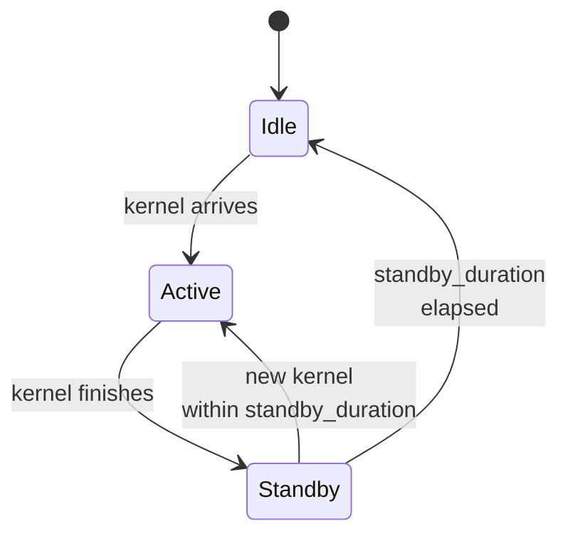

# Power model

When you add a `power:` block to a node in the cluster config, the
simulator tracks system power per-component and integrates over
simulated time to produce a final energy number. This page is the
internal mechanics; the configuration angle is on
**[Examples → Power modeling](/docs/examples/advanced/power-modeling)**.

## What's modeled

`serving/core/power_model.py::PowerModel` tracks per-node power across
six categories:

| Component | Parameters | When it draws |
| --- | --- | --- |
| **Base node** | `base_node_power` (W) | Always (host platform overhead) |
| **NPU** | `idle_power`, `standby_power`, `active_power`, `standby_duration` (per hardware) | Idle when idle, standby for `standby_duration` after compute, active during compute |
| **CPU** | `idle_power`, `active_power`, `util` | `idle + (active - idle) × util` continuously |
| **DRAM** | `dimm_size`, `idle_power` per DIMM, `energy_per_bit` | Idle baseline + per-byte access energy |
| **Link** | `num_links`, `idle_power`, `energy_per_bit` | Idle + per-byte network traffic |
| **NIC** | `num_nics`, `idle_power` | Always (idle baseline) |
| **Storage** | `num_devices`, `idle_power` | Always (idle baseline) |

Each per-node `power:` block in the cluster config sets these
parameters. See the bundled `single_node_power_instance.json` and
`single_node_pim_instance.json` for full examples.

## How the math works

Energy is the integral of power over time. The simulator does this
in nanosecond ticks: every iteration it computes the elapsed time
since the last power update, multiplies by current power, and adds
to the running energy total:

```
ΔE = P(current_state) × Δt    [Joules = Watts × seconds]
total_energy += ΔE
```

The trick is **per-component tracking**. NPU power depends on
whether it's actively running a kernel (active_power), recently
finished (standby_power for `standby_duration` ns, then back to
idle), or idle. The model tracks `last_compute_end_ns` per NPU and
applies the right wattage based on `current_ns - last_compute_end_ns`.

CPU, DRAM, link, NIC, storage are simpler: each has a constant
background draw plus a per-event energy increment for traffic /
access bytes.

## NPU states



The NPU is the most nuanced component. Three states with the
power coefficient that applies in each:

| State | Power | When |
| --- | --- | --- |
| **Active** | `active_power` | Kernel running |
| **Standby** | `standby_power` | Within `standby_duration` ns of last kernel finish |
| **Idle** | `idle_power` | More than `standby_duration` since last kernel |

`standby_duration` (ns) controls how long the NPU stays in the
standby state after a compute finishes. This models the post-kernel
overhead before the device drops back to idle (FP32 result drains,
DMA flushes, etc.). For RTXPRO6000 the bundled config has
`standby_duration: 18` ns; for H100 it's larger (e.g., ~30 ns).

If a new kernel arrives within `standby_duration`, the NPU never hits
idle, it goes active again from standby. This matters for steady-
state workloads where the NPU is more or less always busy.

## Where power gets reported

### Periodic throughput log

Every `--log-interval` seconds, the throughput log line gains a
`power=` field:

```
[INFO] step=42 batch=8 prompt_t=1.2k tok/s decode_t=420 tok/s
       npu_mem=88.4 GB power=712 W
```

`power` is the **current** total system power, the sum of every
component's instantaneous wattage at this moment.

### Final summary

When the simulation ends, `power_model.print_power_summary()` writes
a per-node energy breakdown:

```
─────── Power summary (node 0) ───────
   NPU active     :   12,453 J  (78%)
   NPU standby    :    1,012 J   (6%)
   NPU idle       :       89 J   (1%)
   CPU            :    1,233 J   (8%)
   DRAM           :      442 J   (3%)
   Link           :      388 J   (2%)
   Base + NIC + storage : 332 J  (2%)
   ─────────────────────────────────
   Total energy   :   15,949 J
```

This gets emitted regardless of `--log-level`. The breakdown is what
makes power modeling useful for energy-efficiency research: you can
see which components dominate.

## Multi-node power

Each node has its own `power:` block. The simulator runs all node
power models in parallel and the throughput log line shows them
together:

```
       power=[node0=712 W, node1=689 W]
```

The final summary prints a per-node breakdown plus a cluster total.

## Where the per-NPU active power comes from

`active_power` per NPU is keyed by the `hardware:` field on the
instance:

```json
"power": {
  "npu": {
    "RTXPRO6000": {
      "idle_power": 35,
      "standby_power": 300,
      "active_power": 600,
      "standby_duration": 18
    }
  }
}
```

For multi-hardware clusters, list multiple entries:

```json
"power": {
  "npu": {
    "RTXPRO6000": { ... },
    "H100": { ... }
  }
}
```

The simulator looks up the right entry per instance based on its
`hardware:` field. If your config uses a hardware tag with no
matching power entry, the simulator skips power tracking for that
NPU (with a warning at startup).

## Gotchas

1. **No `power:` block = no power model.** The simulator runs
   normally, just doesn't emit power numbers. Add the block to
   enable; remove it for a slightly faster run.
2. **Power values are estimates.** They're meant for *relative*
   comparison ("does PIM offload save energy vs HBM attention?"),
   not absolute datacenter accounting.
3. **`standby_duration` matters more than you'd think.** Bursty
   workloads with long idle gaps see lots of idle-state energy, while
   steady-state workloads stay in active or standby. If your numbers
   look surprising, check the standby vs idle breakdown in the final
   summary.
4. **Per-event energy is per-byte, not per-operation.** Link energy
   scales with traffic bytes, not collective count. Reducing
   `comm_size` is the lever, not reducing collective frequency.
5. **`--log-interval 0.1` makes the power log very noisy.** Default
   `1.0` is usually right for tracking trends; finer intervals
   produce smoother curves at the cost of longer log files.

## What's next

- **[Examples → Power modeling](/docs/examples/advanced/power-modeling)** -
  configuration walkthrough.
- **[PIM offload](./pim-offload)**: PIM has its own active /
  standby power parameters that integrate with this model.
