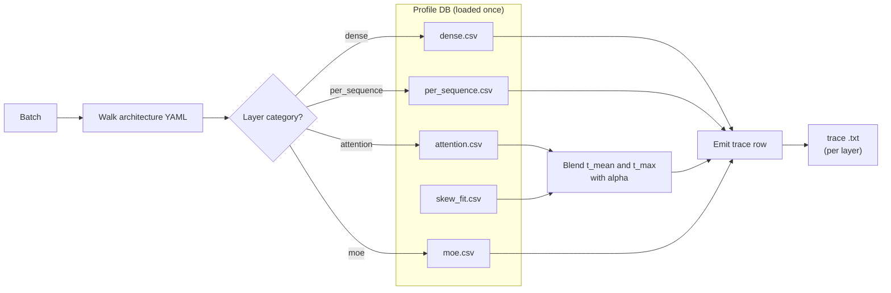

# Trace generation

`trace_generator.generate_trace(...)` is the bridge between the
**profiled latency database** (CSV files produced by the profiler)
and the **per-batch execution trace** that ASTRA-Sim consumes.

It's the page where "the model has 32 decoder blocks, each block has
qkv + attention + o_proj + mlp" turns into "this batch takes
1.78 ms".

> Looking for the trace file format spec? See
> **[Reference → Trace file format](/docs/reference/trace-format)**.
> Looking for how the profiler *produces* the latency database in the
> first place? See **[Profiler → Output bundle](/docs/profiler/output-bundle)**.
> This page is about how the simulator *consumes* it.



## The data the simulator consumes

The profiler writes per-category CSVs at:

```
profiler/perf/<hardware>/<model>/<variant>/tp<N>/{
  dense.csv,
  per_sequence.csv,
  attention.csv,
  moe.csv,           # MoE models only
  skew.csv,          # if heterogeneous-decode sweep is on
  skew_fit.csv       # ditto, the fitted alpha table
}
meta.yaml
```

Where `<variant>` encodes the dtype combination, e.g., `bf16` or
`bf16-kvfp8` or `fp8-kvfp8`. The simulator resolves the variant at
runtime via `resolve_variant(dtype, kv_cache_dtype, model_config)`.

The CSVs hold `time_us` (microseconds). The simulator multiplies by
1000 and rounds to ns at load time, every internal latency is in ns.

## Loading the perf DB

`_load_perf_db(hardware, model, variant)` is called once per
unique `(hardware, model, variant)` triple over the simulator's
lifetime; results are cached in `_perf_db_cache`. Calling it on every
batch would be way too slow.

On first load, the simulator also:

1. Reads `meta.yaml` and compares the runtime's
   `--max-num-batched-tokens` and `--max-num-seqs` against the
   profiled sweep bounds. If you exceed them, you get a one-shot
   warning that lookups will **extrapolate** rather than clamp.
2. Hydrates the skew_fit table (`alpha_by_bucket` map) from
   `skew_fit.csv`.

## Per-category lookup

Each layer in the model's architecture YAML is tagged with a
**category**: dense, per_sequence, attention, or moe. Each category
has its own lookup function:

| Category | Lookup function | Key | Interpolation |
| --- | --- | --- | --- |
| `dense` | `_lookup_dense` | `total_len` (sum of tokens in batch) | 1D linear |
| `per_sequence` | `_lookup_per_sequence` | `num_requests` | 1D linear |
| `attention` | `_lookup_attention` | `(prefill_chunk, kv_prefill, n_decode, kv_decode)` | nearest-neighbour on `(pc, n_dec)`, bilinear on `(kv_pre, kv_dec)` |
| `moe` | `_lookup_moe` | `(local_tokens, activated_experts)` (per rank, profiled at TP=1) | 2D linear |

All lookups **extrapolate** outside the profiled grid (via linear
extension), so a runtime value larger than the largest profiled
sample doesn't fail, it produces a (less reliable) extrapolated
latency. The startup warning above tells you when this is happening.

The `time_us` value at each grid point is converted to ns at load
time, so lookups directly yield ns.

## Variant resolution

`resolve_variant(dtype, kv_cache_dtype, model_config)` mirrors the
profiler's `effective_variant`:

```
dtype           dtype-from-CLI or torch_dtype from model config
                  (default 'bfloat16')

kv_cache_dtype  CLI value, default 'auto' (inherits from dtype)

variant         f"{short(dtype)}"                       # if kv_cache_dtype == 'auto'
                f"{short(dtype)}-kv{short(kv_cache_dtype)}"  # otherwise
```

So:

- `--dtype bfloat16` → `bf16`
- `--dtype bfloat16 --kv-cache-dtype fp8` → `bf16-kvfp8`
- `--dtype fp8 --kv-cache-dtype fp8` → `fp8-kvfp8`

If the resolved folder doesn't exist under `profiler/perf/...`, the
simulator raises a clear `FileNotFoundError` pointing at the missing
variant. Either profile that combo with `--variant <name>` on the
profiler, or pick a different dtype combination.

## Heterogeneous-decode skew correction

FlashAttention's varlen kernel pays tile-padding and SM-imbalance
costs when a decode batch has non-uniform KV lengths. The plain
attention grid can't see that, it's profiled with uniform
`kv_decode` per shot. So the profiler runs a **second sweep** on
bimodal batches (`skew.csv`) and fits a per-bucket
**alpha** ∈ [0, 1] that says how far along the mean→max line a
skewed batch lands:

```
alpha = (t_skew - t_mean) / (t_max - t_mean)
```

At runtime, `_lookup_attention_with_skew` does **two** 4D attention
lookups, one at the batch's `kv_decode_mean`, one at `kv_decode_max`
- and blends them:

```
t_attention = t_mean + alpha * (t_max - t_mean)
```

The bucket key is built from five axes:
`pc | n_label | skew_rate_label | kv_big_label | kp_label`

- `pc`: prefill chunk size (bucket per profiled value).
- `n_label`: `n_decode` value (bucket per profiled value).
- `skew_rate_label`: normalized skew rate, fixed [0,1] scheme.
- `kv_big_label`: log-4× bins of the long KV.
- `kp_label`: `kv_prefill` value (bucket per profiled value).

The bucket axis definitions live in
`meta.yaml::skew_fit.bucket_axes`, so widening the profile sweep
lights up finer resolution without any simulator code change.

If the skew sweep wasn't run (`SKIP_SKEW=1` at profile time), the
simulator falls back to a pooled constant alpha. The profile angle
of skew correction is documented on
**[Profiler → Skew & alpha fit](/docs/profiler/skew-alpha-fit)**.

## Walking the architecture YAML

Each model has an architecture YAML at
`profiler/models/<model_type>.yaml` (e.g., `llama.yaml`,
`qwen3_moe.yaml`). The YAML has:

- A `catalog:` mapping canonical layer names (e.g., `qkv_proj`,
  `attention`, `moe`) to vLLM class names.
- A `sequence:` describing the per-iteration layer order:
  `prologue → pre_attn → post_attn → (mlp_dense | mlp_moe) → head`.

`trace_generator._emit_sequence` walks the sequence list and emits
one trace row per layer. It also:

- Attaches **TP-ALLREDUCE** after `o_proj` and `down_proj` when
  `tp_size > 1`.
- Wraps the MoE block with **EP-ALLTOALL** markers when MoE is
  active.
- Swaps in PIM attention before the NPU attention kernel when
  `--enable-attn-offloading` is on.
- One-shot-warns when a sequence layer is missing from the profile
  CSVs (so you know to extend the profile).

## Where DP groups change things

When instances are in a `dp_group`, trace generation is **deferred**
until all DP members have scheduled their batches for the current
iteration. The simulator collects each member's `total_len`, takes
the **max** across the group, and uses that for the EP-ALLTOALL
`comm_size`:

```
comm_size_alltoall = max(total_len_per_member) * hidden_size * fp_size
```

Each member's trace still uses its own per-instance `total_len` for
the dense and attention kernels, only the ALLTOALL is synchronized.
This matches what production MoE serving does (vLLM CUDA-graph
padding to the max in the wave).

The full DP+EP wave-sync mechanics live on
**[Parallelism mechanics](./parallelism-mechanics)**.

## Block copy optimization

For models with `num_hidden_layers > 1` (i.e., all of them), the
trace's transformer blocks are identical except for layer index.
Generating each layer's row separately is wasteful, so by default
`enable_block_copy=True`:

- Generate the full trace for **block 0** only.
- For blocks 1..N-1, emit a single Chakra `block_copy` instruction
  that replays block 0's compute pattern with adjusted layer indices.

This is **always** safe for dense models. For MoE with
`--expert-routing-policy COPY` (the default), it's also safe because
all blocks route the same tokens through the same experts. For
`--expert-routing-policy RR | RAND | CUSTOM`, expert distribution
varies per layer, and `block_copy` becomes an approximation, the
trace generator turns it off automatically in those modes.

## Per-rank latency for MoE

MoE uses `EXPERT {i}` / `EXPERT END` markers in the trace, with one
`COMP_NODE` per EP rank. Each rank's latency comes from the MoE CSV
keyed on its **local** token count and activated experts (profiled
at TP=1). Ranks execute in parallel and synchronize at the
ALLTOALL barrier.

Expert-to-rank assignment uses even partitioning:
`expert_id * ep_size // num_experts`.

## Gotchas

1. **`time_us` in CSV is microseconds.** The simulator converts to
   ns at load time. If you're cross-referencing a CSV row against
   a simulator log line, multiply by 1000.
2. **No calibration scaling.** Profiled latencies are used directly,
   not rescaled. If your profiles look off, re-profile rather than
   tweaking a "scale factor", there isn't one.
3. **First-load is slow** (perf DB parsing); subsequent loads hit
   `_perf_db_cache`. Restarting the simulator pays the parse cost
   again.
4. **Variant folder must exist.** Mismatched dtype + KV combo →
   `FileNotFoundError`. Either profile that combo or pick a different
   `--dtype` / `--kv-cache-dtype` pair.
5. **Skew correction only fires when the skew sweep was profiled.**
   Otherwise you get a single pooled alpha, which is correct on
   average but loses heterogeneity sensitivity.

## What's next

- **[Parallelism mechanics](./parallelism-mechanics)**: what
  TP-ALLREDUCE / EP-ALLTOALL actually look like in the trace.
- **[Reference → Trace file format](/docs/reference/trace-format)**
  the field-by-field spec of the text trace this page produces.
