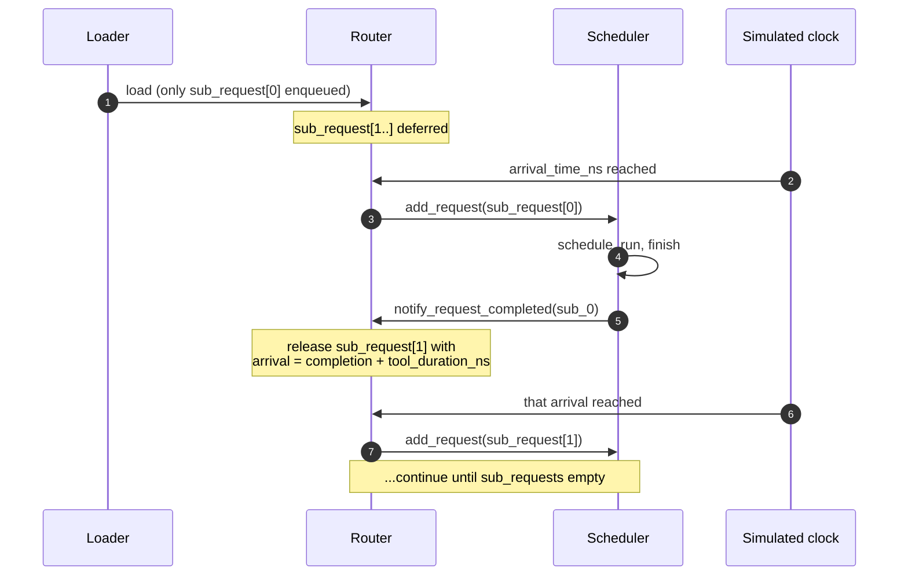

# Agentic sessions

A standard inference benchmark like ShareGPT models *independent*
prompts: each request is one prompt → one response, and the next
request is unrelated to the previous one. Real production traffic
for **agents** doesn't look like this.

A coding agent (Cursor, Aider, or SWE-bench solvers) runs a tight
loop: ask the LLM what to do → run a tool (compile, test, search) →
feed the result back → ask the LLM the next thing → run another tool
→ ... A request budget for "1000 SWE-bench problems" is really 1000
*sessions*, each with 5–50 chained LLM calls and tool waits in
between.

That's what the **agentic** workload format is for.

## The format

Each JSONL line is one session:

```json
{
  "session_id": "session_42",
  "arrival_time_ns": 4059740,
  "sub_requests": [
    {"input_toks": 1472, "output_toks": 133, "tool_duration_ns": 127348767},
    {"input_toks": 1582, "output_toks": 125, "tool_duration_ns": 197295027},
    {"input_toks": 1734, "output_toks": 77,  "tool_duration_ns": 0}
  ]
}
```

Three sub-requests, with `tool_duration_ns` between each, that's the
simulated time spent running tools (test runner, web fetch, file
search) between LLM calls. The simulator doesn't simulate the tool
itself, it just waits.

Full schema reference is on
**[JSONL format → Agentic format](./jsonl-format#agentic-format)**.

## How the simulator handles dependency chains

When the workload is loaded, **only the first sub-request** of each
session is added to `Router._pending_requests`. The rest live in
`Router._deferred_sessions`, keyed by session id.



`Router.has_deferred_sessions()` keeps the main loop from exiting
while sessions are still active (otherwise a workload with a long
final tool_duration could exit prematurely between sub-requests).

For the full lifecycle, see
**[Simulator → Request lifecycle](/docs/simulator/request-lifecycle#agentic-sessions-when-stage-10-is-not-the-end)**.

## Bundled SWE-bench example

The repo ships
`workloads/swe-bench-qwen3-30b-a3b-50-sps0.2.jsonl`: 50 SWE-bench
sessions for `Qwen3-30B-A3B-Instruct-2507`, arriving at 0.2
sessions/second.

A typical session in this file has 8-15 sub-requests with input
lengths in the 1000-3000 token range and tool durations of 50-300 ms
(the wait while pytest runs, etc).

Run it with the bundled DP+EP MoE config:

```bash
python -m serving \
  --cluster-config 'configs/cluster/single_node_moe_dp_ep_instance.json' \
  --dtype bfloat16 --block-size 16 \
  --dataset 'workloads/swe-bench-qwen3-30b-a3b-50-sps0.2.jsonl' \
  --output 'outputs/swebench_run.csv' \
  --num-req 1
```

`--num-req 1` means one *session* (which expands to 8-15
sub-requests). Bump it for longer runs.

## Building your own agentic workload

There's no bundled generator for agentic format, chain extraction
depends on your data source. The pattern:

1. **Extract sessions from your trace source.** For SWE-bench, that's
   one session per problem; for browser-agent traces, one session per
   user task.
2. **For each session, extract the per-call (prompt, response) pairs
   and tool durations.** Tool duration is wall-clock time between
   the assistant message and the next user message in the trace.
3. **Tokenize prompts** with the simulator's target model's
   tokenizer. Optionally tokenize responses too if you want
   downstream analysis.
4. **Write one JSONL line per session** with the schema from
   [JSONL format → Agentic](./jsonl-format#agentic-format).

A minimal Python sketch:

```python
import json
from transformers import AutoTokenizer

tok = AutoTokenizer.from_pretrained("Qwen/Qwen3-30B-A3B-Instruct-2507")

with open("workloads/my-agentic.jsonl", "w") as f:
    for session_id, calls in extract_sessions_from_my_data():
        sub_requests = []
        for prompt, response, next_call_delay_ns in calls:
            ids_in = tok.encode(prompt)
            ids_out = tok.encode(response)
            sub_requests.append({
                "input_toks": len(ids_in),
                "output_toks": len(ids_out),
                "input_tok_ids": ids_in,
                "output_tok_ids": ids_out,
                "tool_duration_ns": next_call_delay_ns,
            })
        # last sub-request has no follow-up
        if sub_requests:
            sub_requests[-1]["tool_duration_ns"] = 0

        f.write(json.dumps({
            "session_id": session_id,
            "arrival_time_ns": session_start_ns(session_id),
            "sub_requests": sub_requests,
        }) + "\n")
```

Adjust the `extract_sessions_from_my_data()` and
`session_start_ns()` to your dataset.

## Picking arrival rates

Agentic workloads are usually **much sparser** than ShareGPT-style
workloads in arrival rate, because each session lasts much longer
in simulator-time:

| Workload | Typical sps | Why |
| --- | --- | --- |
| ShareGPT | 5-20 | Each request finishes in 1-5 seconds; high arrival rate keeps the scheduler busy |
| Agentic SWE-bench | 0.1-0.5 | Each session can run for 30-120 seconds; even 0.2 sps overlaps many sessions |

The bundled SWE-bench file uses `sps=0.2`. With 50 sessions arriving
over 250 simulator-seconds and each running ~60 seconds, you get
~12 sessions active concurrently, a realistic load.

## Mixing flat + agentic in one file

The loader handles per-line auto-detection, so you can have:

```jsonl
{"input_toks": 100, "output_toks": 50, "arrival_time_ns": 0}
{"session_id": "s0", "arrival_time_ns": 1000000, "sub_requests": [{"input_toks": 200, "output_toks": 100, "tool_duration_ns": 0}]}
{"input_toks": 150, "output_toks": 80, "arrival_time_ns": 2000000}
```

Useful when you want a sanity-baseline of independent prompts mixed
with agentic sessions.

## Gotchas

1. **Last sub-request's `tool_duration_ns` should be 0** (or just
   omitted in your generator if you treat 0 as default). Non-zero
   keeps the session "alive" past its real end and the simulator
   waits unnecessarily.
2. **Session arrival_time_ns is for the *first* sub-request.**
   Subsequent sub-requests have their arrival times computed at run
   time as `previous_completion + tool_duration_ns`.
3. **Pre-tokenize for prefix caching.** Agentic sessions usually have
   *very* high prefix overlap between sub-requests (each call shares
   the system prompt + previous turns). Without
   `input_tok_ids`, you lose the bulk of the savings.
4. **Sessions are scheduled to whichever instance is least loaded
   at the time of *each* sub-request's release.** A long agent run
   could hop between instances in a multi-instance config. If you
   want sticky session-to-instance affinity, use `CUSTOM` routing
   (see `serving/core/router.py`).

## What's next

- **[Simulator → Request lifecycle](/docs/simulator/request-lifecycle)**
  what happens at runtime when the simulator processes a session.
- **[Examples → DP+EP MoE](/docs/examples/parallelism/dp-ep-moe)** -
  uses the bundled SWE-bench agentic workload.
